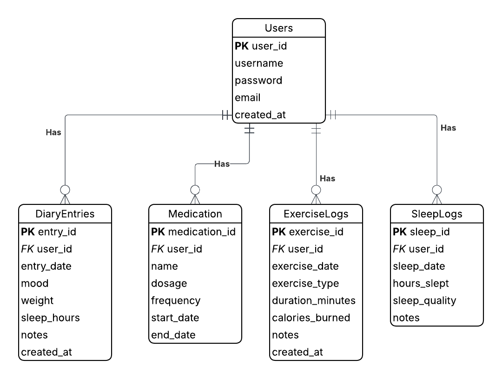
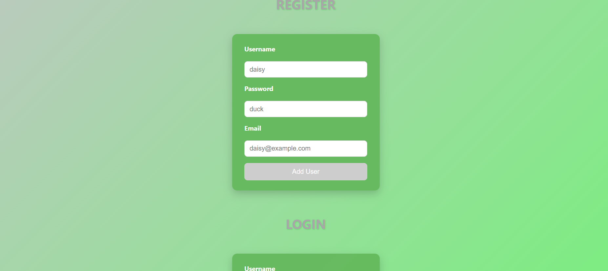
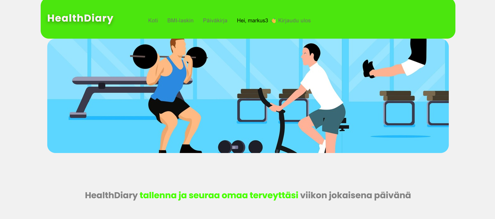
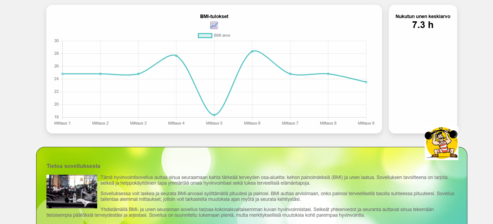
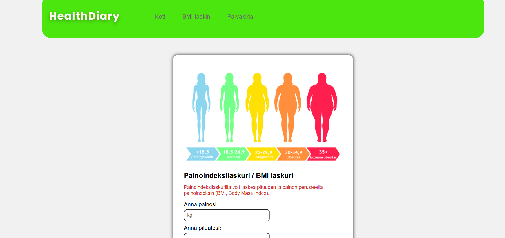
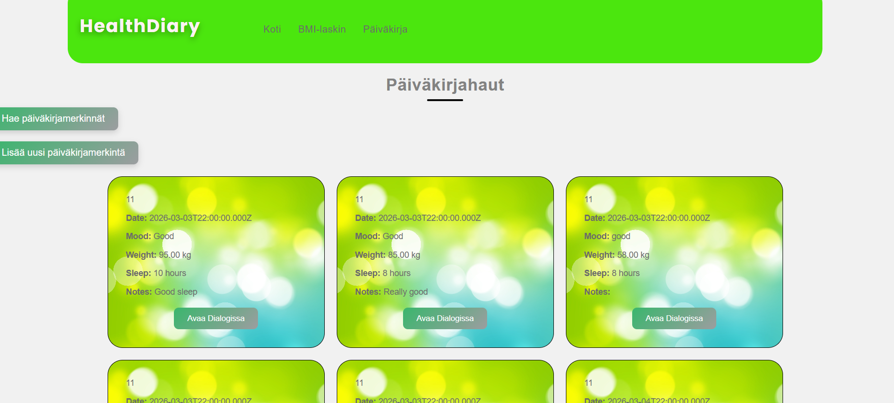
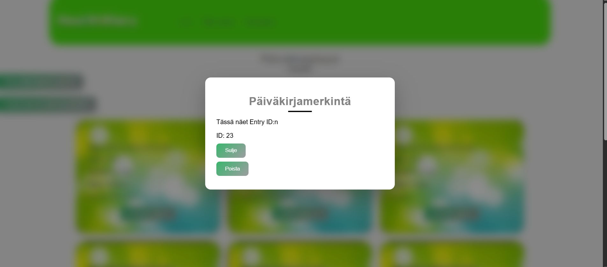
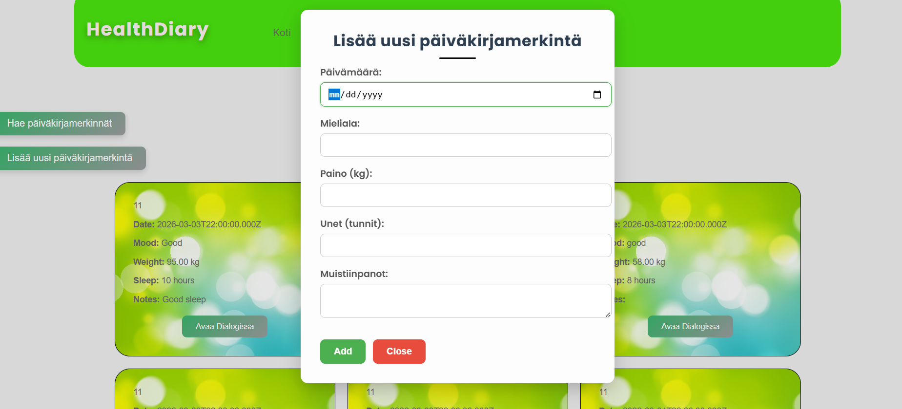

# 🩺 HealthDiary

Yksinkertainen verkkosovellus henkilökohtaisten terveystietojen seurantaan.

Käyttäjät voivat seurata unta, laskea BMI:n ja pitää henkilökohtaista terveispäiväkirjaa.

## ✨ Ominaisuudet

- 👤 Käyttäjärekisteröinti
- 🔐 Kirjautuminen ja uloskirjautuminen
- 😴 Unen keskiarvon seuranta
- ⚖️ BMI-kaavio
- 🧮 BMI-laskuri
- 📓 Päiväkirjamerkintöjen katselu
- ➕ Päiväkirjamerkintöjen lisääminen
- ❌ Päiväkirjamerkintöjen poistaminen

Huomio AI:n käytöstä
Osa CSS- ja JavaScript-tiedostoista on tuotettu tekoälyn (ChatGPT ja Copilot) avulla, mutta kaikki koodi on manuaalisesti kirjoitettu, tarkistettu ja täysin ymmärretty. Kooditiedostoissa on kommentteja, joissa mainitaan AI:n hyödyntäminen.

## Database

Tietokannan rakenne esitetty kuvana

## Kuvakaappaukset sovelluksesta

### Kirjautumissivu

### Etusivu

### BMI-sivu

### Päiväkirjasivu

## 🐞 Mahdolliset bugit

- Päiväkirjasivun footer näkyy aluksi liian ylhäällä
- BMI-sivun navbar ei ole täysin sama kuin muilla sivuilla, mutta toimii.
- BMI-mittaukset katoavat kirjautumisen yhteydessä.

## 📚 Lähteet

- https://www.w3schools.com/
- AI-työkalut: ChatGPT (v5.2), Microsoft Copilot.

AI:n käyttö projektissa:
- CSS-tyylien ideointi
- Javascript funktiot
- Koodin tarkastus ja ehdotukset

Julkaistu sovellus:
- https://users.metropolia.fi/~markkaur/web_hyte/Final%20version/dist/

